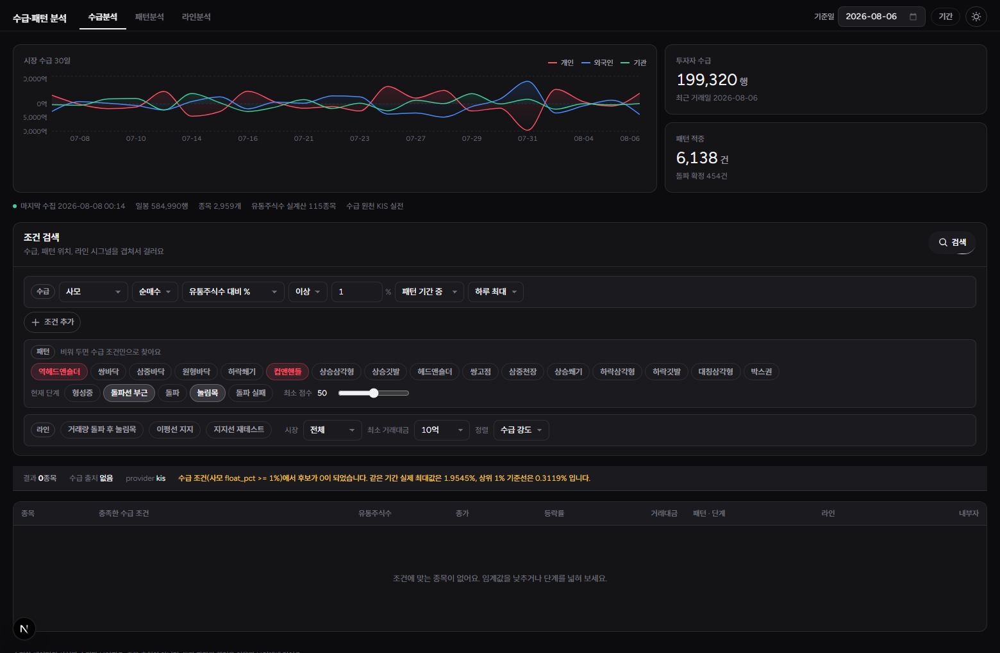
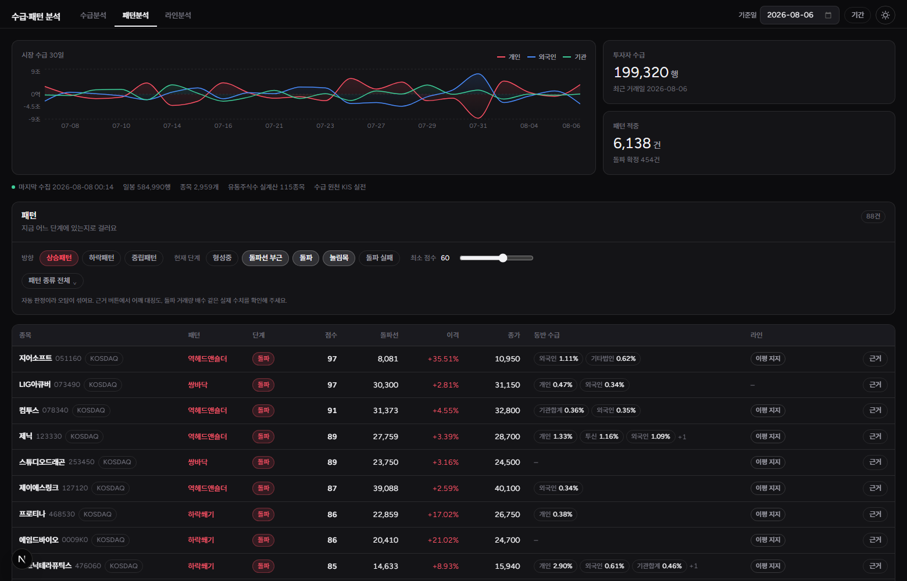
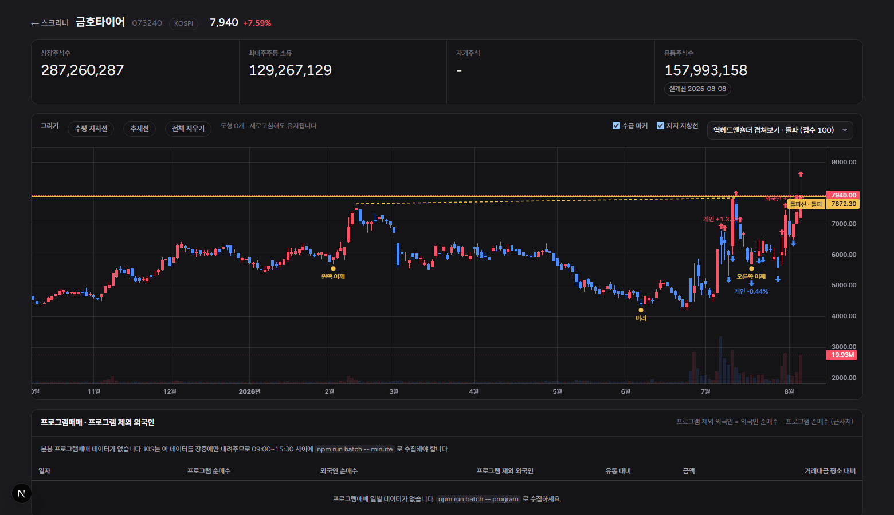

# Investor Flow · Pattern Platform

국내 주식의 **투자자별 수급**을 **차트 패턴의 현재 위치**와 겹쳐서 조건 검색하는 리서치 도구입니다.

"사모펀드가 유통주식수의 1% 이상 사들였는데, 그게 역헤드앤숄더 형성 구간 안이고, 지금 넥라인 부근이거나 돌파 후 눌림목인 종목"처럼 **수급과 기술적 위치를 동시에 거는 질문**에 답하려고 만들었습니다. 수급만 보는 도구나 패턴만 보는 도구는 많지만, 둘을 교집합으로 거는 도구가 없어서 직접 만들었습니다.



## 무엇을 하는가

### 1. 수급분석

주체 12구분(개인, 외국인, 기타외국인, 기관합계, 금융투자, 보험, 투신, **사모**, 은행, 기타금융, 연기금, 기타법인)을 각각 조건으로 걸 수 있습니다. 조건은 세 축을 AND로 묶습니다.

| 축 | 예시 |
|---|---|
| 수급 | 사모, 순매수, 유통주식수 대비 0.5% 이상, 패턴 기간 중, 하루 최대 |
| 패턴 위치 | 역헤드앤숄더 또는 컵앤핸들이면서 현재 단계가 돌파선 부근 또는 눌림목 |
| 라인 시그널 | 거래량 돌파 후 눌림목, 3·5일 이평선 지지 |

조건에 맞는 종목이 없으면 **그 기간의 실제 최대값과 상위 1% 기준선을 함께 알려줍니다.** 임계값이 현실과 얼마나 떨어져 있는지 모르면 조건을 고칠 수 없기 때문입니다.

### 2. 패턴분석



StockCharts ChartSchool 분류를 기준으로 일봉에서 기하학적으로 판정 가능한 16종을 구현했습니다.

| 방향 | 패턴 |
|---|---|
| 상승 8종 | 역헤드앤숄더, 쌍바닥, 삼중바닥, 원형바닥, 하락쐐기, 컵앤핸들, 상승삼각형, 상승깃발 |
| 하락 6종 | 헤드앤숄더, 쌍고점, 삼중천장, 상승쐐기, 하락삼각형, 하락깃발 |
| 중립 2종 | 대칭삼각형, 박스권 |

**"패턴이 있다"만으로는 쓸모가 없습니다.** 지금 그 패턴의 어디에 있는지가 판단의 재료이므로, 모든 적중에 단계를 함께 판정합니다.

| 단계 | 뜻 |
|---|---|
| 형성중 | 구조는 성립하나 돌파선에서 멀다 |
| 돌파선 부근 | 넥라인·돌파선 ±3% 안 |
| 돌파 | 돌파 직후 3봉 이내 |
| 눌림목 | 돌파 후 되돌려 돌파선 부근까지 왔고, 돌파선은 아직 지키고 있다 |
| 돌파 실패 | 돌파 후 돌파선을 다시 잃었다 |

자동 판정이라 오탐이 섞입니다. 그래서 모든 적중은 **근거**에 실제 수치를 남깁니다. 어깨 대칭도, 컵 깊이, 바닥 체류 봉수, 돌파 거래량 배수, 추세선 R²를 직접 확인하고 판단하시면 됩니다.

### 3. 라인분석

변곡점을 군집화해 지지·저항선을 만들고, 평소 거래량의 1.8배 이상으로 그 선을 돌파한 뒤 되돌아와 아직 지키고 있는 종목을 찾습니다. 3일선·5일선 지지도 함께 봅니다.

### 종목 상세



일봉 차트 위에 패턴 골격(어깨, 머리, 넥라인, 돌파선)을 겹쳐 그리고, **언제 얼마나 수급이 들어왔는지**를 봉에 화살표로 표시합니다. 지지선 그리기는 저장되어 새로고침해도 남습니다.

프로그램매매 패널은 **프로그램 제외 외국인**을 계산합니다. 외국인 순매수에서 프로그램 순매수를 뺀 값으로, 차익거래가 아닌 실수요 외국인 물량을 근사합니다.

## 데이터 출처

| 데이터 | 출처 | 비고 |
|---|---|---|
| 투자자별 수급 12구분 | 한국투자증권 Open API `FHPTJ04160001` | 실전 계좌 초당 15건, 모의 초당 2건. 도메인에 `vts` 포함 여부로 자동 전환 |
| 일봉 | DATA.go.kr 금융위원회 주식시세정보 | 전 종목을 한 번에. T+1 공시라 당일치는 다음 날 들어온다 |
| 분봉 | KIS `FHKST03010200` (당일), Yahoo Finance (과거 소급) | provider 폴백. 1분봉은 약 14일, 5분봉은 약 57일까지 |
| 프로그램매매 | KIS `FHPPG04650101` / `FHPPG04650201` | 장중에만 내려온다 |
| 임원·주요주주 지분변동 | OpenDART `elestock` + 원문 파싱 | 변동전 + 증감 = 변동후 항등식으로 증감 열을 식별 |
| 유통주식수 | OpenDART `hyslrSttus`, `tesstkAcqsDspsSttus` | 상장주식수에서 최대주주 소유분과 자기주식을 뺀 실계산. 미확보 종목은 상장주식수로 대체하고 화면에 표시 |

수급 원천은 `InvestorFlowProvider` 인터페이스 뒤에 있습니다. 환경변수 하나로 갈아끼울 수 있고, 재배포가 제한된 데이터를 쓰는 provider는 라이선스 가드가 걸려 있습니다.

> KRX Data Marketplace 데이터는 재배포 제한이 있어 이 저장소에 포함하지 않았습니다. 해당 provider를 쓰시려면 직접 계약 후 내려받아 `data/krx-csv/`에 두시면 됩니다.

## 기술 구성

```
Next.js 15 (App Router, Turbopack) + TypeScript + Tailwind v4
lightweight-charts (일봉·패턴 오버레이) / recharts (수급 시계열)
PGlite (PostgreSQL 18 WASM) 소켓 서버 또는 Supabase
```

DB는 표준 `pg` 드라이버로 붙습니다. `DATABASE_URL` 만 바꾸면 로컬 PGlite와 Supabase 사이를 오갈 수 있습니다.

### 디자인 시스템

Meta의 [Astryx](https://astryx.atmeta.com/)에서 규칙을 가져왔습니다. 표면 톤 4단으로 층을 만들고 그림자를 쓰지 않으며, 테두리는 별도 회색이 아니라 전경색의 10% 알파입니다.

**UI 액센트는 무채색입니다.** 이 화면에서 적색은 상승·순매수, 청색은 하락·순매도로 이미 예약되어 있어서, UI 액센트에 유채색을 쓰면 "선택됨"과 "하락"이 시각적으로 섞입니다. 금색은 아직 확정이 아닌 상태(넥라인 부근, 유통주식수 추정) 하나에만 씁니다.

## 시작하기

### 1. 설치

```bash
npm install
cp .env.example .env.local
```

`.env.local`에 키를 채웁니다. 최소한 다음 두 가지가 필요합니다.

| 변수 | 발급처 |
|---|---|
| `KIS_APP_KEY`, `KIS_APP_SECRET` | [한국투자증권 KIS Developers](https://apiportal.koreainvestment.com/) |
| `DATA_GO_KR_KEY` | [공공데이터포털](https://www.data.go.kr/) 금융위원회 주식시세정보 |
| `DART_API_KEY` (선택) | [OpenDART](https://opendart.fss.or.kr/) 유통주식수 실계산과 임원 매수 교차확인용 |

### 2. DB 기동과 마이그레이션

```bash
npm run db:server
```

> PGlite 소켓 서버는 **반드시 별도 터미널에서 포그라운드로** 띄우세요. 백그라운드 서브셸로 분리하면 셸이 종료될 때 WAL 플러시 없이 죽어 데이터 디렉터리가 손상됩니다. 복구 도구가 없어 재수집이 유일한 방법입니다.

다른 터미널에서:

```bash
npm run migrate
```

### 3. 데이터 수집

```bash
npm run batch -- ohlcv --date 2026-08-06 --days 220
npm run batch -- flow --date 2026-08-06 --lookback 30
npm run batch -- dart --date 2026-08-06
npm run batch -- patterns --date 2026-08-06
npm run batch -- lines --date 2026-08-06
npm run batch -- flow-events --date 2026-08-06
```

`--date`를 넘기지 않으면 오늘로 잡히고, 오늘 일봉이 아직 없으면 대상이 0건이 됩니다. 기준일은 항상 명시하세요.

한 번에 돌리려면:

```bash
npm run batch -- all --date 2026-08-06
```

### 4. 실행

```bash
npm run dev
```

`.env.local`을 고친 뒤에는 개발 서버를 **재시작**해야 합니다. 그냥 두면 워커가 죽으면서 모든 API가 500을 반환합니다.

## 보안

공개 저장소이므로 키가 섞여 들어가는 사고를 사람의 주의력에 맡기지 않습니다. `.githooks/pre-commit`이 커밋 자체를 차단합니다.

```bash
git config core.hooksPath .githooks
```

클론한 뒤 위 한 줄을 실행하면 활성화됩니다. 훅이 잡는 것:

- `.env` 계열 파일 스테이징 (`.env.example`만 허용)
- KIS App Key 형태(`PS` + 영숫자 30자 이상)와 긴 base64 시크릿
- 코드에 하드코딩된 `apiKey`, `secret`, `token` 대입문
- `NEXT_PUBLIC_` 에 붙은 `KEY`, `SECRET`, `TOKEN` 이름
- 클라이언트 컴포넌트에서 서버 전용 환경변수를 읽는 코드

`NEXT_PUBLIC_` 값은 클라이언트 번들에 그대로 실려 누구나 볼 수 있습니다. 이 저장소의 모든 API 키는 서버 라우트와 배치 스크립트에서만 읽습니다.

## 면책

이 도구는 **수집한 데이터의 사실과 순위만 보여줍니다.** 종목 추천, 매매 지시, 목표가 제시를 하지 않으며, 수익률을 보장하거나 예측하지 않습니다. 패턴 판정은 자동화된 기하학적 근사이며 오탐을 포함합니다. 투자 판단과 그 결과에 대한 책임은 전적으로 이용자 본인에게 있습니다.

데이터 제공처의 이용약관과 재배포 정책은 각자 확인하고 준수하셔야 합니다.
